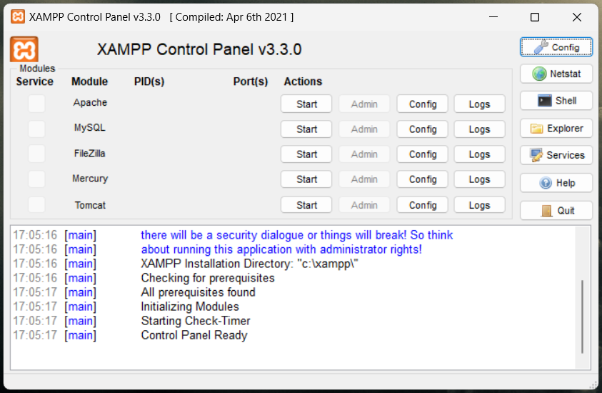
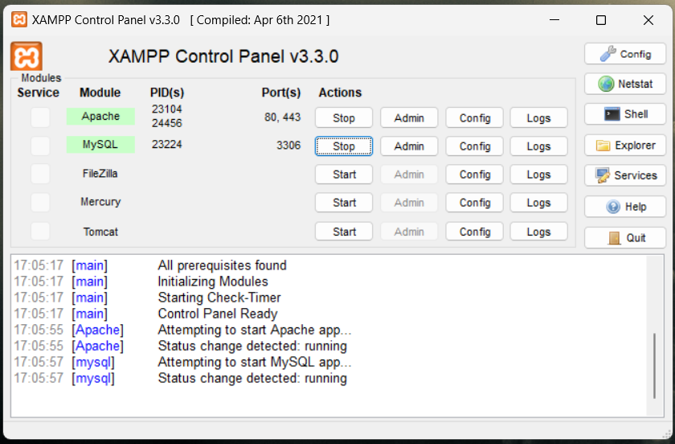
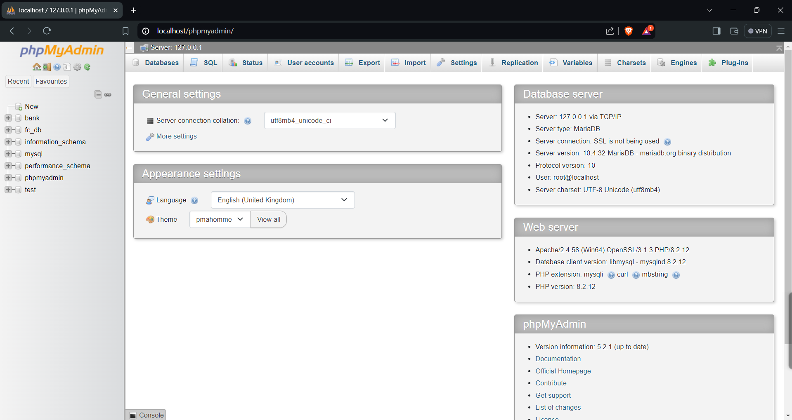

# Installing dependencies

1. XAMPP :- Cross Platform, Apache, MariaDB(MySQL), PHP, Perl
2. WAMPP :- Windows, Apache, MariaDB(MySQL), PHP, Perl
3. LAMPP :- Linux, Apache, MariaDB(MySQL), PHP, Perl

- XAMPP :-  Default Ports: Apache (80,443) , MySQL(3306)

Installation Link: [Link Here](https://www.apachefriends.org/download.html)

- After Successful Installation 
    1. Open XAMPP Control panel
    2. **Start** Actions for Apache and MySQL
    3. Open **Admin** for MySQL

| XAMPP Control Panel                              | Start Apache & MySQL                            |
| ------------------------------------------------ | ----------------------------------------------- |
|  |  |

| Admin Panel                                     |
| ----------------------------------------------- | 
|  |
